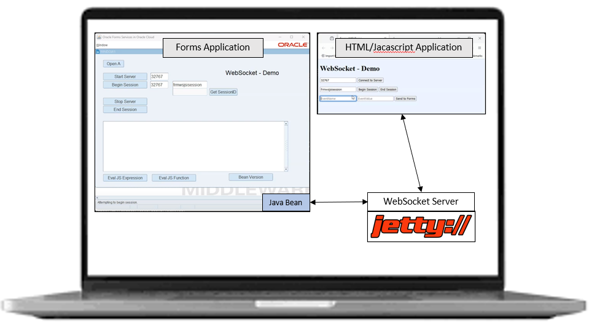
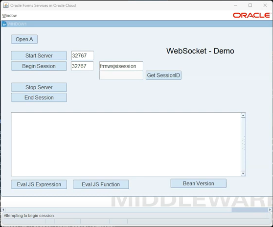
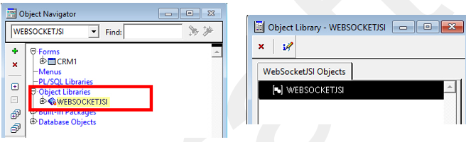
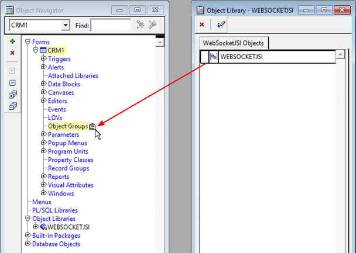
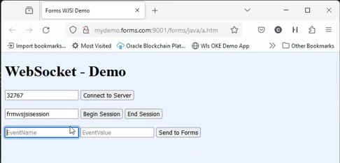

# Oracle Forms WebSocket Javascript Integration (WJSI) with an HTML/Javascript application (Springboot & Angularjs, APEX, ...)

This project is a tutorial that allows you to demonstrate how 2 applications (a Forms Application and an HTML/Javascritp Application) car collaborate via events on the laptop of a customer. This is a common use case. A lot of customers have Forms critical business application in production and need to collaborate with other applications that are generally today HTML/Javascript Application.

Authors : ***Michael Ferrante*** (Oracle Forms Product Manager), ***Christope Pruvost*** (OCI EMEA Specialist Application Development)

## Prerequisites

You need to have a Forms server 12C last version installed and ready (and an Oracle Database sure). If not you can do that easily on Oracle Cloud Infrastructure. To help you look at these 2 tutos :
    - [LiveLabs Migrate Oracle Forms to OCI](https://apexapps.oracle.com/pls/apex/r/dbpm/livelabs/view-workshop?wid=3168&clear=RR,180&session=10852400993645)
    - [Forms Terraform Automation on OCI](https://github.com/cpruvost/autoforms)

You need a JDK supported by Forms 12C last version Standalone Launcher on your laptop (ex : 17.0.5+).

You must know Forms (be able to install Forms Server and be able to use Forms Builder)

You must be able to create a simple HTML page with input fields, and buttons that run javascript functions. 

## Architecture


So the architecture is really simple. We use an extremly lightweigth server (jetty). Forms Application starts the WebSocket server and begins a session. The HTML/Javascript connects to the server and begins a session (with the same name). After that :

- Forms Application can trap an event sent by the HTML/Javascript Application (EX : Employee Number, 67667).
- Forms Application can send a javascript code that returns a result to the HTML/JavaScript that will execute it (Button Eval JS Function on the demo)
- Forms Application can send a javascript code that doesn't return a result to the HTML/JavaScript that will execute it (Button Eval JS Expression on the demo). For ex here you can manipulate the dom and update a field of the HTML page.
  
## Step 1 : Sign the Jetty Server Jar File

For this demo you can autosigned the jar but in production you must use a certificate validated by a Certicication Authority.

Let's see how to autosign the jar.

You can download the jar on this url : [Jetty Jar File](https://repo1.maven.org/maven2/org/eclipse/jetty/aggregate/jetty-all/9.4.10.v20180503/jetty-all-9.4.10.v20180503-uber.jar)

Use keytool to create your keys.

```
keytool -genkey -alias server -keyalg RSA -keypass password -storepass password -keystore keystore.jks
What is your first and last name?
[Unknown]: John Wick
What is the name of your organizational unit?
[Unknown]: Domain Specialist
What is the name of your organization?
[Unknown]: EMEA
What is the name of your City or Locality?
[Unknown]: Nantes
What is the name of your State or Province?
[Unknown]: Loire Atlantique
What is the two-letter country code for this unit?
[Unknown]: FR
Is bla bla bla ...
correct?
[no]: yes
```
With the keys create and stored, export the server certificate to the filesystem so we can use it in the jarsigner’s sign and verify process
```
keytool -export -alias server -storepass password -file server.cer -keystore keystore.jks
Certificate stored in file <server.cer>
```
Sign the jar with jarsigner (that is in the JDK)
```
jarsigner -keystore keystore.jks -jettyformssigned.jar jetty-all-9.4.10.v20180503-uber.jar server
Enter Passphrase for keystore: password
jar signed.
Warning: The signer's certificate is self-signed.
```
Then ***copy the jettyformssigned.jar*** in the Forms Server in the directory : ***Oracle_Home/forms/java*** and restart the managed WebLogic Server "WLS_FORMS" using the WebLogic Administration console.

## Step 2 : Create your demo fmb with Forms Builder



Ex: the name of this fmb could be : websocketjsi_demo2.fmb

***Adding the Forms WJSI Objects to the Application***

Browse in the ORACLE_HOME/forms directory of the Forms installation to find the Forms WJSI Object Library, websocketJSI.olb. 
In the Form Builder, open websocketJSI.olb then open the Object Library window by double-clicking on it from within the Object Navigator.



Drag the WEBSOCKETJSI object from the Object Library window into the application and drop it in the Object Group node.



When prompted to Sub-class or Copy, choose the option that suits your needs best.  In most cases, choosing Sub-class is preferred.  By sub-classing, if the object library should become updated in the future, regenerating the application will result in the previously sub-classed object(s) to be updated.  If “Copy” is selected, the objects will not be automatically updated when regenerating with a new/updated Object Library

***Adding the Forms WJSI PL/SQL Library to the Application***
In the Object Navigator, add a new attached library, by selecting the Attached Libraries node for this form then  clicking on the Create button (or Ctrl+Insert on the keyboard).  Browse in the ORACLE_HOME/forms directory to find websocketJSI.pll and select it.  This file is located in the same directory with websocketJSI.olb.  When prompted to “Remove path?” click on Yes.
It is recommended that before attempting to generate the FMX for this form that all the PL/SQL is compiled (e.g. Shift+Ctrl+K) and the FMB saved.

***Button "Open A"*** : Trigger WHEN-BUTTON-PRESSED
```
WEB.SHOW_DOCUMENT ('/forms/java/a.htm','a_page');
```
It will launch our HTML/JavaScript Application in your default browser.

***Button "Start Server"*** : Trigger WHEN-BUTTON-PRESSED
```
CLEAR_MESSAGE;
	message('Attempting to start server.', NO_ACKNOWLEDGE);
SYNCHRONIZE;

--Check port availability
	websocketJSI.SETPORT(:block1.s_port);
	IF NOT websocketJSI.ISPORTAVAILABLE THEN
		MESSAGE ('Port is in use.');
		GO_ITEM ('block1.s_port');
		SELECT_ALL;
		RAISE FORM_TRIGGER_FAILURE;
	END IF;

-- Try to start server
IF NOT websocketJSI.ISSERVERUP THEN
	-- Server does not appear to be running, so start it.
	websocketJSI.StartServer(:block1.s_port);
	CLEAR_MESSAGE;
ELSE
	MESSAGE ('WJSI server already running.');
END IF;
```
It will start the WebSocker Server locally on the laptop of the customer.

***Button "Begin Session"*** : Trigger WHEN-BUTTON-PRESSED
```
CLEAR_MESSAGE;
	message('Attempting to begin session.');
SYNCHRONIZE;

/*
--Check sessionID availability
	--websocketJSI.SETPORT(:block1.s_port);
	IF NOT websocketJSI.ISPORTAVAILABLE THEN
		MESSAGE ('Port is in use.');
		GO_ITEM ('block1.s_port');
		SELECT_ALL;
		RAISE FORM_TRIGGER_FAILURE;
	END IF;

*/
IF websocketJSI.ISSERVERUP THEN
	-- Server is running, so start session.
	websocketJSI.BeginSession(:block1.c_port, :block1.sessionid);

ELSE
	CLEAR_MESSAGE;
	MESSAGE ('WJSI server not running.');
END IF;
```
It will start a session with the WebSocket Server.

***Button "Stop Session"***
```
message('Attempting to end session.');
SYNCHRONIZE;
websocketJSI.EndSession;
```
It will stop the session with the WebSocket Server.

***Button "Stop Server"***
```
message('Attempting to stop server.');
SYNCHRONIZE;
websocketJSI.StopServer;
```
It will stop the WenSocket Server on the laptop of the customer.

***Button "Get SessionID"***
```
-- Show sessionID currently in use.
IF websocketjsi.ISSESSION THEN
	:BLOCK1.RTN_SESSIONID := websocketjsi.GetSessionId;
ELSE
	CLEAR_MESSAGE;
	MESSAGE('No active session detected.');
END IF;
```
It will show you the active WebSocket Session Id.

***Button "Bean Version"***
```
websocketJSI.ShowBeans(TRUE);
```
It will show you the version of the Java Bean used by Forms to communicate with the WebSocket Server.

***Button "Eval JS Expression"***
```
--message('begin');
websocketJSI.javascript_eval_expr(:block1.JSEXPR);
```
It will send the Javascript code written in the central input field to the HTML/Javascript Application and this code will be executed. Ex : Update an HTML input field using DOM.

***Button "Eval JS Function"***
```
message('FUNC Return: ' || websocketJSI.javascript_eval_function(:block1.JSEXPR), NO_ACKNOWLEDGE);
``` 
It will send the Javascript code written in the central input field to the HTML/Javascript Application and this code will be executed and then will return a result to the Forms Application.

***Add a Trigger WHEN-CUSTOM-JAVASCRIPT-EVENT to the forms Module***
```
begin
	CLEAR_MESSAGE;
	MESSAGE('WCJSE fired:  ' || :system.javascript_event_name || ':' || :system.javascript_event_value);
end;
```
It will allow Forms to catch events sent by the HTML/Javascript Application

***

###Create the HTML/Javascript Demo Application (a simple html page)



You can use Visual Studio Code to do that for example.

***Create a javascript file named frmwebsocket_demo.js***
```
function connect() {
    var serverPort = document.getElementById("serverPort").value;
    
    // Check if it is not empty
    if (serverPort === "") {
        serverPort = 32767;
    }

    frmwebsocketjsi.connectToServer(serverPort);
}

function getSessionId() {
	var formsSessionId = document.getElementById("formsSessionId").value;

	// Check if it is not empty
	if (formsSessionId === "") {
		formsSessionId = "frmwsjsisession";
	}
	return formsSessionId;
}

function connectToFormsSession() {
	var formsSessionId = getSessionId();

    // Check if it is not empty
	if (formsSessionId === "") {
		return;
	}
	else
	{
		var ret = frmwebsocketjsi.beginSession(formsSessionId);
		if (ret != 1) {
			alert('Connection error. Please connect to server');
		}
	}
}

function closeFormsSession() {
	frmwebsocketjsi.closeSession();
}

function sendToForms () {
    var eventName = document.getElementById("inputEventName").value;
	var eventValue = document.getElementById("inputEventValue").value;

    // Check if it is not empty
    if (eventName === "") {
        alert("Please enter the Event Name.");
        return;
    }
	
	// Check if it is not empty
    if (eventValue === "") {
        alert("Please enter the Event Value.");
        return;
    }

    // Reset textarea
    document.getElementById("inputEventName").value = "";
	document.getElementById("inputEventValue").value = "";

    // Update UI
    console.log(eventName + "," + eventValue);

	frmwebsocketjsi.raiseEvent(eventName, eventValue);
}
```
This code is not mandatory, it is just a way to have more simple names when calling javascript funtions in the html page

***Add the 2 javascript libraries in the html page***
```
<head>
	<title>Forms WJSI Demo</title>
	<meta charset="utf-8"/>
	<script type="text/javascript" src="/forms/java/frmwebsocketjsi.js"></script>
	<script type="text/javascript" src="/forms/java/frmwebsocketjsi_demo.js"></script>	
</head>
```
Note that frmwebsocketjsi.js is the javascript library installed by default with Forms. You can have a look to the javascript code in this library as it is a very simple code. Note that the frmwebsocketjsi.js is in the ORACLE_HOME/forms/java directory on the Forms Server.

***Define the function called on the button "connect to server"***
```
<div>
    <input id="serverPort" value="32767">
    <button onclick="connect()">Connect to Server</button> 
</div>
```
It will connect the HTML/Javascript Application to the local WebSocket Server running on the laptop of the customer

***Define the function called on the button "Begin Session" and "End Session"***
```
<div>            
    <input id="formsSessionId" value="frmwsjsisession">
    <button onclick="connectToFormsSession()">Begin Session</button>
    <button onclick="closeFormsSession()">End Session</button><br/>
</div>
```
It will start and stop the WebSocket Session on the WebSocket Server.

***Define the function called on the button "send to forms"*** 

```
<div>
    <input id="inputEventName" placeholder="EventName">
    <input id="inputEventValue" placeholder="EventValue">
    <button onclick="sendToForms()">Send to Forms</button>
</div>
```

##Deploy your 2 applications on the Forms Server

***Copy the HTML/Javascript Application files to the Forms Server***
We need a web server to allow us to call the HTML/Javascript Application from a brower so for the demo we can use the Forms WebLogic Managed Server as it is very simple to do that.

Copy the files a.htm and frmwebsocket_demo.js in the ORACLE_HOME/forms/java directory on the Forms Server.

**Copy Forms Application to the Forms Server**

Copy the file websocketjsi_demo2.fmb in the good directory in Forms (I do not detail that part as you must mastering Forms).

In formsweb.cfg (on the forms server), create a section for your Forms application
```
[websocketjsiforms]
baseSAAfile=basesaa.txt
fsalcheck=true
form=websocketjsi_demo2.fmx
userid={AES}wzaSIdofZMceW23UuWDoeNVwk2E42MS4BcmZTo72yps=
archive=frmall.jar,frmwebsocketjsi.jar,jettyformssigned.jar
```

##Test the Demo
***Use the Forms Standalone Launcher to start the Forms Application***
Open a command line window and run the Forms Standalone Launcher but before replace mydemo.forms.com by the good IP Address.
```
java -jar frmsal.jar -url "http://mydemo.forms.com:9001/forms/frmservlet?config=websocketjsiforms" -t 30000 -showConfig true -showDetails 1
```

Reproduce the demo like it is done on the Youtube Video here : https://www.youtube.com/watch?v=QV7KhLElAFc
